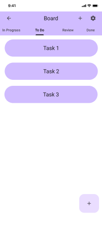
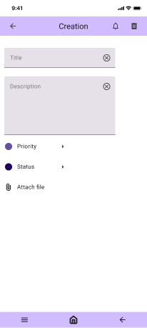
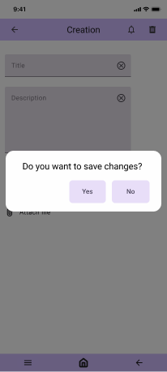
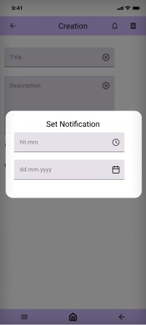
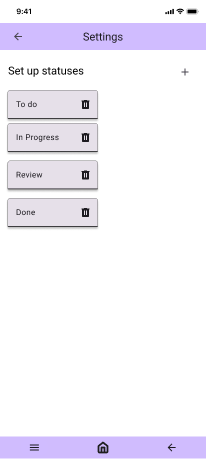

# Требования к проекту
---

# Содержание
1. [Введение](#intro)  
   1.1 [Назначение](#appointment)  
   1.2 [Бизнес-требования](#business_requirements)  
   1.2.1 [Исходные данные](#initial_data)  
   1.2.2 [Возможности бизнеса](#business_opportunities)  
   1.2.3 [Границы проекта](#project_boundary)  
   1.3 [Аналоги](#analogues)  
   1.3.1 [Toggl Track](#toggl_track)  
   1.3.2 [Todoist](#todoist)  
   1.3.3 [Google Календарь](#google_calendar)  
   1.3.4 [Trello](#trello)
2. [Требования пользователя](#user_requirements)  
2.1 [Программные интерфейсы](#software_interfaces)  
2.2 [Интерфейс пользователя](#user_interface)  
2.3 [Характеристики пользователей](#user_specifications)  
2.3.1 [Классы пользователей](#user_classes)  
2.3.2 [Аудитория приложения](#application_audience)  
2.3.2.1 [Целевая аудитория](#target_audience)  
2.3.2.1 [Побочная аудитория](#collateral_audience)  
2.4 [Предположения и зависимости](#assumptions_and_dependencies)  
3. [Системные требования](#system_requirements)  
3.1 [Функциональные требования](#functional_requirements)  
3.1.1 [Основные функции](#main_functions)  
3.1.1.1 [Вход пользователя в приложение](#user_login_to_the_application)  
3.1.1.2 [Настройка профиля пользователя](#setting_up_the_profile_of_the_active_user)  
3.1.1.3 [Добавление активностей](#add_notation)  
3.1.1.4 [Выход пользователя из учётной записи](#active_user_change)   
3.1.2 [Ограничения и исключения](#restrictions_and_exclusions)  
3.2 [Нефункциональные требования](#non-functional_requirements)  
3.2.1 [Атрибуты качества](#quality_attributes)  
3.2.1.1 [Требования к удобству использования](#requirements_for_ease_of_use)  
3.2.1.2 [Требования к безопасности](#security_requirements)  
3.2.1.3 [Требования к производительности](#performance_requirements)  
3.2.2 [Внешние интерфейсы](#external_interfaces)  
3.2.3 [Ограничения](#restrictions)  

<a name="intro"/>

# 1 Введение
TimeWise - это мобильное приложение для тайм-менеджмента, разработанное для платформы Android. Оно предназначено для управления временем и задачами, а также для повышения производительности и эффективности работы.
<a name="appointment"/>

## 1.1 Назначение
Помочь пользователям управлять своим временем и задачами, повышать производительность и эффективность работы.

<a name="business_requirements"/>

## 1.2 Бизнес-требования
Приложение должно быть простым в использовании и иметь интуитивно понятный интерфейс.
Приложение должно иметь функции управления задачами, напоминаниями и таймером.
Приложение должно иметь возможность создания проектов, а также добавления тегов и меток для задач.
Приложение должно иметь функцию отслеживания времени, затраченного на задачи.
Приложение должно иметь возможность синхронизации данных между устройствами.
<a name="initial_data"/>

### 1.2.1 Исходные данные
Идея приложения основана на анализе рынка мобильных приложений для тайм-менеджмента
В качестве аналога было выбрано приложение Toggl Track

<a name="business_opportunities"/>

### 1.2.2 Возможности бизнеса
Есть возможность грамотно монетизировать рекламой исходя из данных о пользователе.
В функционал можно добавить API для взаимодействия с физическими устройствами тайм-трекинга.
Приложение может быть монетизировано путем введения платной подписки с дополнительными функциями.
Приложение может быть расширено для других платформ, таких как iOS и Windows.
<a name="project_boundary"/>

### 1.2.3 Границы проекта
Разработка приложения будет проводиться только для платформы Android.
Приложение будет иметь базовый набор функций, не включающий сложные алгоритмы и функции машинного обучения.

<a name="analogues"/>

## 1.3 Аналоги

<a name="toggl_track"/>

### 1.3.1 Toggl Track

**Русский интерфейс:** нет
**Цена:** бесплатный  
**Ссылка на сайт производителя:** https://toggl.com/track/

Toggl Track - приложение для учета времени, которое позволяет отслеживать время, затраченное на задачи, и создавать отчеты

<a name="todoist"/>

## 1.3.2 Todoist
**Русский интерфейс:** есть  
**Цена:** бесплатный  
**Ссылка на сайт производителя:** https://todoist.com/

Todoist - приложение для управления задачами, которое позволяет создавать проекты, добавлять задачи и устанавливать напоминания

<a name="google_calendar"/>

## 1.3.3 Google Календарь
**Русский интерфейс:** есть  
**Цена:** бесплатный

Google Календарь - приложение для планирования и управления временем, которое позволяет создавать события и напоминания

<a name="trello"/>

## 1.3.4 Trello
**Русский интерфейс:** есть  
**Цена:** бесплатный
**Ссылка на сайт производителя:** https://trello.com/

Trello - приложение для управления проектами, которое позволяет создавать виртуальные доски с карточками, добавлять участников и устанавливать сроки исполнения

<a name="comparison_of_applications"/>

# 2 Сравнение приложений

| Функция |  Toggl Track | Todoist | Google Календарь | Trello |
|:---|:---:|:---:|:---:|:---:|
| Поддержка русского языка | + | + | + | + |
| Бесплатное использование | + | + | + | + |
| Календарь | + | - | + | + |
| Напоминания | + | + | + | + |
| Липкие заметки | - | + | - | + |
| Поддержка мобильных устройств | + | + | + | + |
| Задачи| + | + | - | + |
| Создание проектов| + | - | - | + |

<a name="user_requirements"/>

# 2 Требования пользователя

<a name="software_interfaces"/>

## 2.1 Программные интерфейсы
Приложение использует базу данных MongoDB. В основе приложения - стандартные библиотеки Android SDK. Болле подробно архитектура описана в [Специфике реализации](https://github.com/HeChert0/TimeWise/blob/main/Documentation/etc_prod.md)

Мокапы были выполнены в Figma - [Design](https://www.figma.com/design/mhEkevU8rTZjIcI0PoLDon/Untitled?node-id=0-1&t=4SIUpoWDpTMOD0QJ-1)

<a name="user_interface"/>

## 2.2 Интерфейс пользователя
  

При входе в приложение открывается окно с задачами в статусе To Do. Возможна навигация в верхнем меню по задачам с разным статусами. В левом верхнем углу находится кнопка выхода из приложения. В правом верхне углу две кнопки - для добавления задачи и открытия настроек. По центру отображены задачи, а также в правом нижнем углу для удобства пользователя находится кнопка добавления задачи.

  

В этом окне можно создавать новую задачу. При открытии в полях уже установлены плейсхолдеры. Требуется ввести название задачи и ее описание. Пользователь может прикрепить к задаче любой файл. Здесь реализована нативная работа с Android API, поэтому интерфейс будет понятен и удобен каждому пользователю. При создании есть возможность выбора приоритета и статуса задчи.

  

При нажатии на иконку для возвращения на главный экран в левом верхнем углу появится окно, которые уточняет у пользователя, стоит ли сохранять задачу с текущими данными или ее стоит удалить.

  

Для задачи возможно установить уведомление. Здесь также реализована работа с Android API, так что и звук уведомленя будет стандартный для конфигурации системы пользователя. Само уведомление появляется в окне уведомлений android. Пользователю нужно заполлнить два поля - времени и даты. Справа есть кнопки для более удобного выбора.

  

В окне настроек пользователь может добавить свой собственный статус задач, удалить и изменить существующие. Максимум возможно создании 5 статусов, так как большее количетсво делает навигацию по приложению неудобной.

При нажатии на икнонку добавления всплывает окно с одним полем - названием статуса. После добавления новый статус сражу же будет отображен в меню настроек и появится в меню навигации на главном экране.

<a name="user_specifications"/>

## 2.3 Характеристики пользователей

<a name="user_classes"/>

### 2.3.1 Классы пользователей

| Класс пользователей | Описание |
|:---|:---|
| Зарегистрированные пользователи | Пользователи, которые вошли в приложение под своим именем (псевдонимом), желающие просматривать списки своих записей. Имеют доступ к полному функционалу |

<a name="application_audience"/>

### 2.3.2 Аудитория приложения

<a name="target_audience"/>

#### 2.3.2.1 Целевая аудитория
Люди средней возрастной категории со средним или выше среднего уровнем образования, обладающие минимальной технической грамотностью.

<a name="collateral_audience"/>

#### 2.3.2.2 Побочная аудитория
Люди младшей и старшей возрастных категорий, обладающие минимальной технической грамотностью.

<a name="assumptions_and_dependencies"/>

## 2.4 Предположения и зависимости
Подключение Google аккаунтов для авторизации.
Отправка уведомление на Google почту

<a name="system_requirements"/>

# 3 Системные требования

<a name="functional_requirements"/>

## 3.1 Функциональные требования

<a name="main_functions"/>

### 3.1.1 Основные функции

<a name="user_login_to_the_application"/>

#### 3.1.1.1 Вход пользователя в приложение
**Описание.** Пользователь не имеет возможность использовать приложение без создания собственного профиля либо вхождения в свою учётную запись.

| Функция | Требования | 
|:---|:---|
| Регистрация нового пользователя | Приложение должно запросить у пользователя ввести имя и пароль для создания учётной записи. Пользователь должен либо ввести имя и пароль, либо отменить действие |
| Вход зарегистрированного пользователя в приложение | Приложение  запоминает пользователя и пропускает пользователя на главное окно |

<a name="setting_up_the_profile_of_the_active_user"/>

#### 3.1.1.2 Настройка профиля пользователя
**Описание.** Зарегистрированный пользователь имеет возможность редактировать своё имя и пароль.
 
| Функция | Требования | 
|:---|:---|
| Изменение имени пользователя | Приложение должно запросить ввести новое имя а также пароль для подтверждения действия. Если выбранное имя уже существует, приложение предоставит возможность повторного ввода |
| Изменение пароля | Зарегистрированный пользователь имеет возможножность изменить пароль, при этом приложение запрашивает ввести старый пароль для подтверждения личности |
| Удаление учётной записи пользователя | Зарегистрированный пользователь имеет возможность удалить созданную учётную запись, для чего приложение запрашивает пароль |

<a name="add_notation"/>

#### 3.1.1.3 Добавление активностей
**Описание.** После входа пользователя в приложение или после завершения радактирования профиля зарегистрированным пользователем возможно создание активностей.

| Функция | Требования | 
|:---|:---|
| Создание активностей | Приложение должно создать событие, предоставив пользователю бланк заполнения события, в котором указана дата события и описание |
| Редактирование активностей | Приложение должно предоставить доступ к уже созданной записи, для её дополнения/изменения |
| Просмотр активностей | Приложение должно показывать активности на временной шкале календаря |

<a name="active_user_change"/>

#### 3.1.1.4 Выход зарегистрированного пользователя из учётной записи
**Описание.** Зарегистрированный пользователь имеет возможность выйти из учётной записи.

**Требование.** Приложение должно предоставить зарегистрированному пользователю возможность выйти из учётной записи с возвратом к окну входа в приложение.

<a name="restrictions_and_exclusions"/>

### 3.1.2 Ограничения и исключения
1. Приложение работает корректно только при точно установленной дате;

<a name="non-functional_requirements"/>

## 3.2 Нефункциональные требования

<a name="quality_attributes"/>

### 3.2.1 Атрибуты качества

<a name="requirements_for_ease_of_use"/>

#### 3.2.1.1 Требования к удобству использования
1. Доступ к основным функциям приложения не более чем за две операции;
2. Все функциональные элементы пользовательского интерфейса имеют названия, описывающие действие, которое произойдет при выборе элемента;
3. Пошаговая инструкция использования основных функций приложения отображена в справке;
<a name="security_requirements"/>

#### 3.2.1.2 Требования к безопасности
Приложение предоставляет возможность просмотра и редактирования активностей только авторизированному пользователю.

<a name="#performance_requirements"/>

### 3.2.1.3 Требования к производительности
ОС Android версии не ниже 7.0, 1гб оперативной памяти.

<a name="external_interfaces"/>

### 3.2.2 Внешние интерфейсы
Окна приложения удобны для использования пользователями с плохим зрением:
  * размер шрифта не менее 14пт;
  * функциональные элементы контрастны фону окна.

<a name="restrictions"/>

### 3.2.3 Ограничения
1. Приложение реализовано на платформе Kotlin Android SDK;
2. Все записи хранятся в базе данных Room(SQLite).
